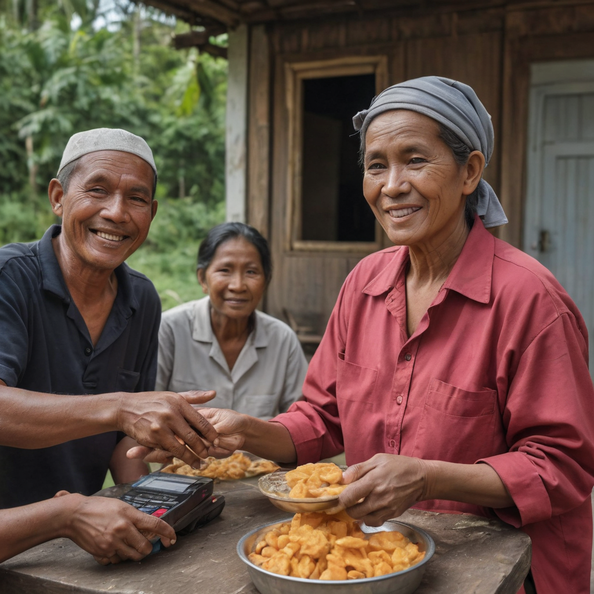

---
taxonomy:
    category:
        - animals
    tag:
        - cats
published: true
media_order: 'kitten.jpg,puppy.jpg,rural_people_in_indonesia_transaction_using_bitcoin_to_buy_food_casava_in_realistic_happy_face_seed-0ts-1701907976_idx-0.png'
title: 'Komunitas AI'
---

@adi Academy mempelajari AI dengan menjalankan langsung pada proyek yang berkaitan dengan data.

===

komunitas Kecerdasan Buatan di Indonesia akan segera dibentuk oleh @adi Academy.

Membangun komunitas AI di Indonesia adalah hal yang penting untuk dilakukan. Komunitas AI dapat membantu untuk:

* **Meningkatkan kesadaran dan pemahaman tentang AI**
* **Menyebarkan pengetahuan dan keterampilan AI**
* **Mendorong penelitian dan pengembangan AI**
* **Memfasilitasi kolaborasi dan kerja sama**

Berikut adalah beberapa langkah yang dapat dilakukan untuk membangun komunitas AI di Indonesia:

1. **Membentuk komunitas**

Langkah pertama adalah membentuk komunitas AI. Komunitas ini dapat dibentuk oleh siapa saja, baik individu maupun organisasi. Komunitas dapat dibentuk secara online atau offline.

2. **Menentukan tujuan dan sasaran**

Setelah komunitas terbentuk, perlu ditentukan tujuan dan sasaran komunitas tersebut. Tujuan dan sasaran ini akan menjadi pedoman bagi kegiatan komunitas.

3. **Mengembangkan kegiatan**

Komunitas dapat mengembangkan berbagai macam kegiatan untuk mencapai tujuan dan sasarannya. Kegiatan tersebut dapat berupa:

* **Webinar dan seminar**
* **Workshop dan pelatihan**
* **Hackathon dan kompetisi**
* **Komunitas online**

4. **Mempromosikan komunitas**

Komunitas perlu dipromosikan agar dapat menarik anggota baru. Promosi dapat dilakukan melalui berbagai media, seperti media sosial, website, dan media cetak.

Berikut adalah beberapa contoh komunitas AI di Indonesia:

* **Indonesia AI** adalah komunitas AI terbesar di Indonesia. Komunitas ini memiliki lebih dari 10.000 anggota dari berbagai latar belakang.
* **Jakarta Artificial Intelligence Research** adalah komunitas AI yang berfokus pada penelitian dan pengembangan AI. Komunitas ini memiliki anggota dari berbagai universitas dan perusahaan teknologi.
* **Komunitas Kecerdasan Buatan Indonesia** adalah komunitas AI yang berfokus pada edukasi dan sosialisasi AI. Komunitas ini memiliki anggota dari berbagai kalangan, termasuk pelajar, mahasiswa, dan profesional.

Dengan adanya komunitas AI di Indonesia, diharapkan dapat meningkatkan perkembangan AI di Indonesia.